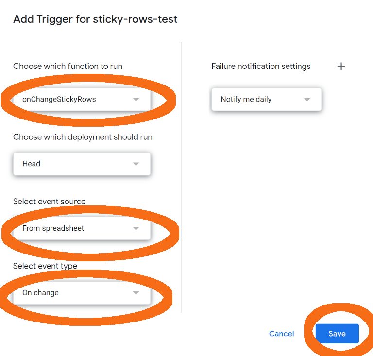

# Sticky Rows

Keep dynamic columns filled via [`IMPORTRANGE()`](https://support.google.com/docs/answer/12159115), [`QUERY()`](https://support.google.com/docs/answer/3093343?hl=en&sjid=16157704238526208353-EU) and the like in sync with manually edited columns.

This means that changes to the order of rows in the **dynamic range** will be reflected to the manually edited part, termed the **sticky range**.

For this to work, the dynamic range and sticky range have to have a (hidden) unique *ID* column as their first columns.

## USAGE

### 1. Install to Spreadsheet

1. As described in the [gapps-automation README](../README.md) this `clasp` command can be used to create a script project in a spreadsheet:
   ```
   clasp create --parentId {SHEET_ID} --rootDir .
   ```
2. Upload/push the script to the newly created project by running the following command in the projects base directory:
   ```
   make sticky-rows/
   ```
   This will automatically build the library (`lib.js`) and upload it together with the script files.

### 2. Install `onChange` Trigger

#### Automatic

Spreadsheet custom functions can't use authenticated parts of the Spreadsheet API, thus we need to run the actual sync inside the context of an installable trigger.

Run the following in the `sticky-rows` subdirectory to set up the trigger:
```
clasp run 'install'
```

#### Manually

The trigger can also be installed manually by following these steps:
1. Open the Script Project in the Google Spreadsheet `Extensions -> Apps Script` menu.
2. Select menu item `Triggers`.
3. Click `+ Add Trigger` and configure the trigger as shown in the following graphics:
  

### 3. Use in a Spreadsheet's Sheet

1. Ensure you have a range with dynamic data setup (using any of Google Spreadsheet's data import functions, like `QUERY()`).
2. Ensure your *dynamic data* range has an *ID column* as first column. The ID value in each row must uniquely identify the record.
3. Ensure your *sticky data* range (the area which should "stick" to the *dynamic data* area) has an empty column used as hidden ID column by the synchronization function.
4. In some cell on your sheet (preferably one that is likely not to be accidentally overwritten), place a call to the `STICKY_ROWS(dynamic_range, sticky_range)` custom function.
   - Assuming our *dynamic data* range is `A3:D1000` and our *sticky data* range is `E3:H1000`, we would call the configuration function as follows:
     ```
     =STICKY_ROWS("A3:D1000";"E3:H1000")
     ```

### Design Alternatives

#### Developer Metadata

The [Developer Metadata](https://developers.google.com/sheets/api/guides/metadata) feature seems convenient to avoid the need for the second hidden *ID* column inside the *sticky data* range.

Unfortunately, as listed in the linked documentation, the character size quotas for developer metadata in spreadsheet sheets is relatively small. Thus, storing the *IDs* in metadata would limit the size of datasets supported by our function to less than ~1000 (depending on the type of ID values used).

2000 rows is far below the [limits of a Google Spreadheet sheet](https://support.google.com/drive/answer/37603):
- 10 million cells
- 18278 columns (max. column `ZZZ`)

If developer metadata limits are increased in the future, supporting that for storing IDs should be re-evaluated.
