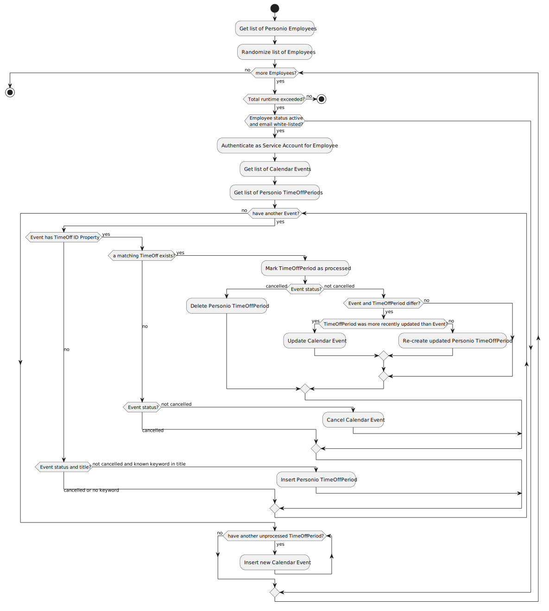

## SyncTimeOffs

Synchronize between Google Personal Calendars and Personio Employee Absence Calendar.

The script performs bidirectional synchronization based on the following algorithm:

### Notes

* A service account with domain-wide delegation and the necessary scopes for Calendar access must be configured
* The Personio API token must be configured and have the `Employees` and `Absences (read/write)` scopes 
* A `ScriptLock` is taken to prevent unsafe parallel execution
* Only Google Calendar Events matching the following rules are synchronized:
  * The lower-case title contains the first word of a Personio TimeOffType (configurable in Personio) or the event has previously been synchronized.
  * The event duration is at least 3h for half-day TimeOffTypes and 6h for whole-day-only TimeOffTypes
* To avoid race-conditions, only events last updated at least 2 minutes ago are synchronized
* To avoid forceful script termination after 6 minutes (Apps Script limit), execution safely stops at 5:20 min
* The Personio API can be very slow, multiple script runs may be needed to synchronize a user's calendar if the user:
  * created/changed a new recurrent event with many occurrences
  * was newly added to the synchronization
  * imported many new events (for example holiday list or a backup)

### Configuration

Configuring the synchronization is possible using ScriptProperties.

The following configuration properties are available:

| Mandatory | Property Key                             | Value Example or Default                       |
|-----------|------------------------------------------|------------------------------------------------|
| **yes**   | SyncTimeOffs.personioToken               | `CLIENT_ID&#124;CLIENT_SECRET`                      |
| **yes**   | SyncTimeOffs.serviceAccountCredentials   | `{SERVICE_ACCOUNT_CREDENTIALS_FILE_CONTENT...}`|
| no        | SyncTimeOffs.allowedDomains              | `giantswarm.io,giantswarm.com`                 |
| no        | SyncTimeOffs.emailWhiteList              | `jonas@giantswarm.io,marcel@giantswarm.io`     |
| no        | SyncTimeOffs.lookaheadDays               | `180`                                          |
| no        | SyncTimeOffs.lookbackDays                | `30`                                           |
| no        | SyncTimeOffs.maxSyncFailCount            | `10`                                           |

